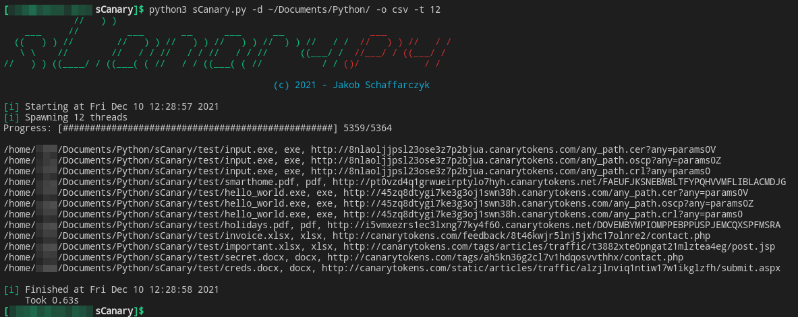

# sCanary - Find canary tokens on your system
## Description
With Canary Tokens (generated [here](https://canarytokens.org/generate)) one can track who opens his documents or files. They are embedded into your files (EXE, PDF, MSOffice) or your network. If an attacker accesses one of these, an alarm will be triggered and you'll be notified via the mail which was deposited at token generation.

## How does sCanary work?
You can either scan single files or a whole directory. The filetype will be detected via magic bytes and trigger execution of the corresponding analysis method.

- As XLSX and DOCX are ZIP archives, they'll be extracted. Via the fingerprints (see `fingerprints.py`) the correct format can be detected. If any valid canary token URL exists within the corresponding artifacts (see `artifacty.py`), the file was secured via a canary token.

- EXE files are easy to analyse, as they can be simply read and searched for any canary-like looking URL.

- PDF files can hide gzip compressed data, in which the request to the canary endpoint is stored. All of them will be decompressed and checked for the existence of a canary token.

All the findings will be gathered and after successfull scanning printed out in either JSON or CSV format for further usage.

For testing, there are some tokenized files attached in the `./test' directory. Don't worry, you can open the files safely if you need to, I won't be notified as I used some random trashmails (like 1f0fc14a-78f0-4865-a75a-51d56e317724@byom.de) for alerting.

> 
Scan example: `python3 sCanary.py -d ~/Documents/Python/ -o csv -t 12`

## Currently supported filetypes
| extension | affected programs* | magic bytes |
| --------- | ----------------- | ----------- |
| .xlsx | Excel | `0x50 0x4b 0x03 0x04` |
| .docx | Word | `0x50 0x4b 0x03 0x04` |
| .pdf | Adobe Acrobat Reader | `0x25 0x50 0x44 0x46` |
| .exe | - | `0x4d 0x5a` |

*list of affected programs may not be complete.

## Usage
usage: `sCanary.᠎py [-h] [-t JOBS] [-o FORMAT] [-d DIRECTORY] [-f FILE]`

optional arguments:
| short | long | parameter | default | description |
| ----- | ---- | --------- | ------- | ----------- |
| -h | --help | - | - | shows this help message and exit | 
| -t | --jobs | JOBS | 16 | Number of threads to spawn |
| -o | --format | FORMAT | json | Output format (json, csv) |
| -d | --directory | DIRECTORY | - | Directory to scan |
| -f | --file | FILE | - | File to scan |

one of -f or -d is **required**

## Further ideas
> Contribution higly welcomed as I'm very busy atm.
- Support for scanning remote URLs
- Support for only scanning files with paths matching a given regex (`glob.glob()`)
- Support for other not yet implemented token usages
- General support for canary-like tokens
- Possibility to add custom regex/rules for not yet implemented tokens
- Cloud support

## Contribution
- Contact me via Mail or any of the mentioned platforms in my [GitHub](https://github.com/js-on) or [website](https://js-on.de/about-me/) profile
- Create an [issue](https://github.com/js-on/sCanary/issues) with your contribution idea and we'll get along.
- Create a pull request (https://github.com/js-on/sCanary/pulls) with your changes 
I'll try to verify and merge them asap.

***This has been tested on Linux only. If you're experiencing any issues on Windows, feel free to file an issue or fix it ;)***

~ Cheers